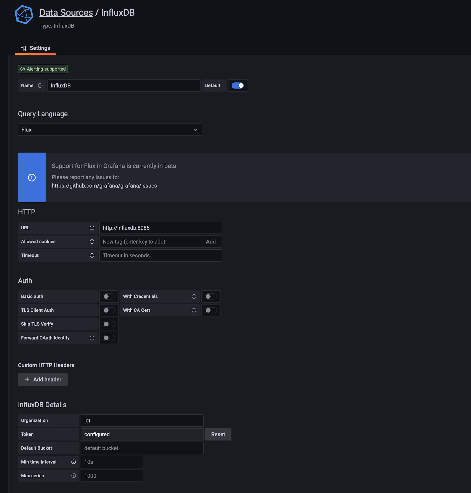

# Backend
## Setup
```
sudo chown 472 data_grafana
docker-compose up [-d]
````
- `-d` startet die Container im Hintergrund. Zum Beenden der Container: `docker-compose down`

## InfluxDB
- http://\<ip\>:8000
- User: iot
- Passwort: iot_2022

## Grafana
- http://\<ip\>:9000
- User: iot
- Passwort: iot_2022

# ESP Codieren, TTN Dekodieren (Decoder)
Konvertiere 2-Byte Zahl in Byte-Array:
```
msgData[0] = distance;
msgData[1]= (distance >> 8);
```

Dekodiere Zahl und sende JSON Payload an MQTT:
```
function Decoder(bytes, port) {
    var decoded = {};
    decoded.temperatur = readUInt16LE(bytes.slice(0, 0 + 2));

    return decoded;
}

/* **************
 * bytes to number
 ****************/
function readUInt16LE(bytes) {
    var value = (bytes[1] << 8) + bytes[0];
    return value & 0xffff;
}
```

Auf MQTT:
```
{
    "temperature": 21,
};
```

## InfluxDB als Grafana Data Source einbinden
- In Grafana anmelden. User und Passwort siehe `docker-compose.yml` unter `GF_SECURITY_ADMIN_USER` und `GF_SECURITY_ADMIN_PASSWORD`.
- Unten in der linken Seitenleiste über das Gear-Icon eine neue Data Source hinzufügen.
- Data Source entsprechend dem Screenshot konfigurieren. Für Token `jfhurtt7G==--_VJHgizgjfh5476-_gzif68` einsetzen. Dies wurde in `docker-compose.yml` unter `DOCKER_INFLUXDB_INIT_ADMIN_TOKEN` definiert.
- `Save & Test` sollte nun eine positive Rückmeldung geben.


